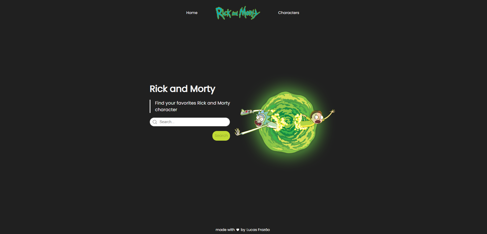

Project created with target to studying and improve my knowledges. Home page design inspired by <a href="https://dribbble.com/shots/14794508-Rick-And-Morty-Concept-Page">Rick And Morty Concept Page</a> and consuming <a href="https://rickandmortyapi.com/">The Rick and Morty API</a>.

   

  <a href="https://curiosity-rick-and-morty.vercel.app/">Check out the live version here</a>

## 🚀 Technologies

- [ReactJs](https://reactjs.org/)
- [TypeScript](https://www.typescriptlang.org/)
- [Styled Components](https://styled-components.com/)
- [Phosphor Icons](https://phosphoricons.com/)
- [Axios](https://axios-http.com/docs/intro)

## 🎉 Contributing

This project follow the [Conventional Commits](https://www.conventionalcommits.org/en/v1.0.0/) specification. If you're a developer it's necessary you are following the Eslint Lint Rules and also the commits convention. But let's go, if you want to contribute to this project, whether by fixing issues, adding comments or improving the documentation, you can follow the steps below:

- [Fork](https://www.atlassian.com/git/tutorials/comparing-workflows/forking-workflow#:~:text=Forking%20is%20a%20git%20clone,org%2FuserA%2Fopen%2Dproject) this repository
- Create a new branch with your changes: `git checkout -b my-feature`
- Save your changes and open a [pull request](https://www.atlassian.com/git/tutorials/making-a-pull-request) telling about your changes

## 📖 License

[MIT License](https://choosealicense.com/licenses/mit/)
